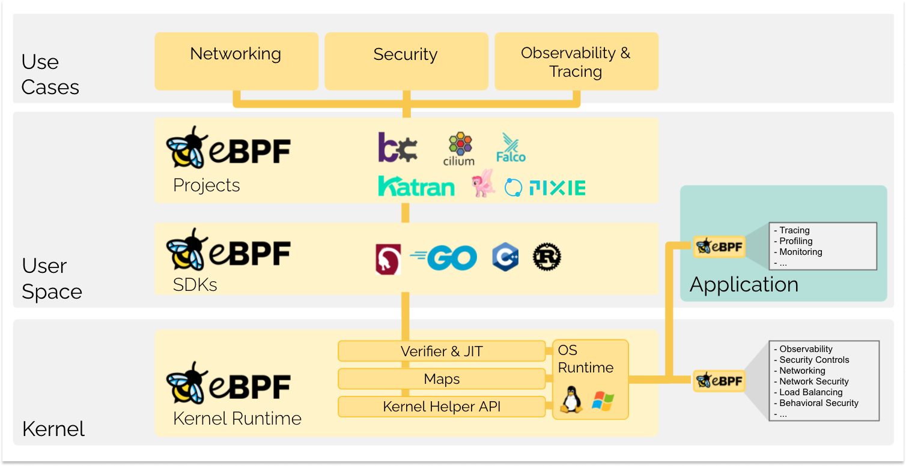
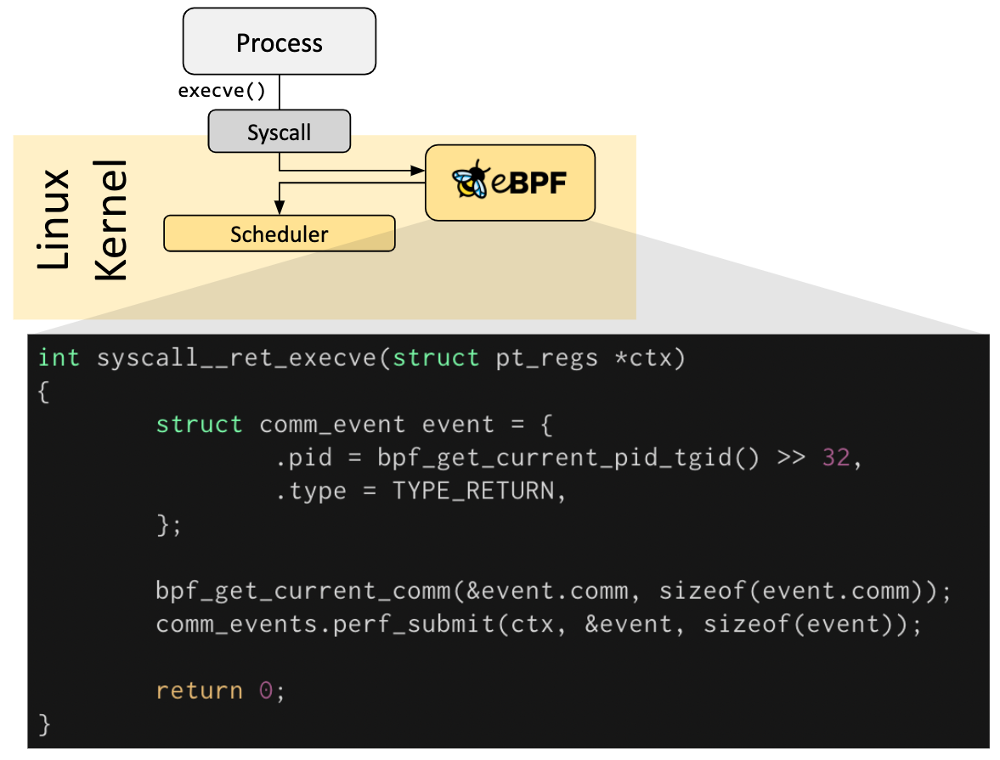
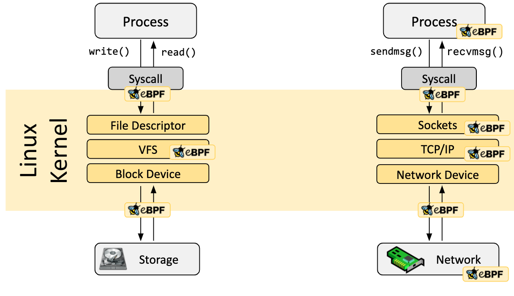
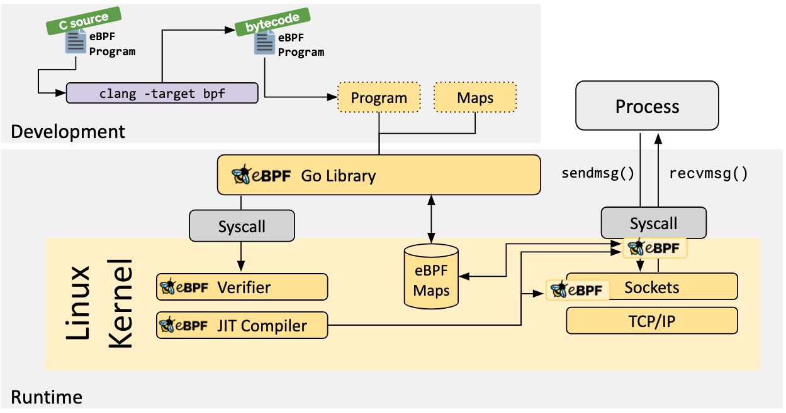
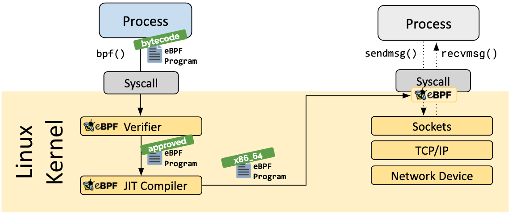
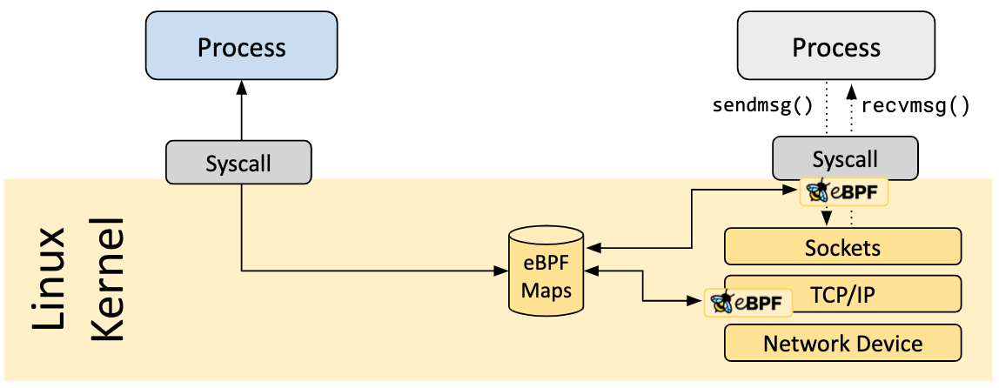
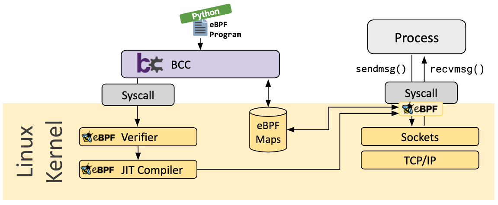

## O que é eBPF?

O eBPF é uma tecnologia revolucionária com origens no kernel Linux que pode executar programas em _sandbox_ em um contexto privilegiado, como o kernel do sistema operacional. Ele é usado para estender com segurança e eficiência as capacidades do kernel sem a necessidade de alterar o código-fonte do kernel ou carregar módulos do kernel.

Historicamente, o sistema operacional sempre foi um local ideal para implementar funcionalidades de observabilidade, segurança e rede, devido à habilidade privilegiada do kernel de supervisionar e controlar todo o sistema. Ao mesmo tempo, evoluir o kernel do sistema operacional é difícil devido ao seu papel central e aos altos requisitos de estabilidade e segurança. Como resultado, a taxa de inovação no nível do sistema operacional tradicionalmente tem sido menor em comparação com as funcionalidades implementadas fora do sistema operacional.

O eBPF muda fundamentalmente essa fórmula. Ao permitir a execução de programas isolados dentro do sistema operacional, os desenvolvedores de aplicativos podem executar programas eBPF para adicionar capacidades adicionais ao sistema operacional em tempo de execução. O sistema operacional, em seguida, garante segurança e eficiência de execução, como se estivesse compilado de forma nativa, com o auxílio de um compilador Just-In-Time (JIT) e um mecanismo de verificação. Isso levou a uma onda de projet os baseados em eBPF, abrangendo uma ampla variedade de casos de uso, incluindo funcionalidades de rede, observabilidade e segurança de próxima geração.

Hoje, o eBPF é amplamente utilizado para impulsionar uma ampla variedade de casos de uso: fornecer rede de alto desempenho e balanceamento de carga em data centers modernos e ambientes nativos em nuvem, extrair dados de observabilidade de segurança de granularidade fina com baixa sobrecarga, ajudar os desenvolvedores de aplicativos a rastrear aplicativos, fornecer insights para solucionar problemas de desempenho, aplicação preventiva e aplicação de segurança de contêiner em tempo de execução, e muito mais. As possibilidades são infinitas, e a inovação que o eBPF está desbloqueando apenas começou.

### O que é o eBPF.io?

O eBPF.io é um espaço para todos aprenderem e colaborarem no tópico do eBPF. O eBPF é uma comunidade aberta e todos podem participar e compartilhar. Se você deseja ler uma primeira introdução ao eBPF, encontrar materiais de leitura adicionais ou dar seus primeiros passos para se tornar um colaborador dos principais projetos do eBPF, o eBPF.io irá ajudá-lo no caminho.

### O que significam eBPF e BPF?

Originalmente, BPF significava Berkeley Packet Filter, mas agora que o eBPF (BPF estendido) pode fazer muito mais do que filtragem de pacotes, o acrônimo não faz mais sentido. O eBPF agora é considerado um termo independente que não representa mais nada. No código-fonte do Linux, o termo BPF persiste, e nas ferramentas e na documentação, os termos BPF e eBPF são geralmente usados de forma intercambiável. O BPF original é às vezes referido como cBPF (BPF clássico) para distingui-lo do eBPF.

### Qual é o nome da abelha?

A abelha é o logotipo oficial do eBPF e foi originalmente criada por Vadim Shchekoldin. No primeiro [eBPF Summit](https://ebpf.io/summit-2020.html), houve uma votação e a abelha foi nomeada de eBee. (Para detalhes sobre usos aceitáveis do logotipo, consulte as [Diretrizes de Marca](https://linuxfoundation.org/brand-guidelines/) da Linux Foundation.)

## Introdução ao eBPF

Os próximos capítulos são uma rápida introdução ao eBPF. Se você deseja aprender mais sobre o eBPF, consulte o [Guia de Referência eBPF & XDP](https://cilium.readthedocs.io/en/stable/bpf/). Seja um desenvolvedor que deseja criar um programa eBPF ou esteja interessado em aproveitar uma solução que usa o eBPF, é útil entender os conceitos básicos e a arquitetura.

### Visão geral do Hook (Ponto de Ancoragem)

Os programas eBPF são baseados em eventos e são executados quando o kernel ou um aplicativo passa por um determinado ponto de ancoragem (hook). Os pontos de ancoragem pré-definidos incluem chamadas do sistema, entrada/saída de funções, pontos de rastreamento do kernel, eventos de rede e vários outros.

Se um gancho predeterminado não existe para uma necessidade em particular , É possível criar um kernel probe (kprobe)ou usuário probe (uprobe) para anexar programas eBPF praticamente em qualquer lugar do kernel ou aplicações do usuário.

### Como os programas de eBPF são escritos ?

Em muitos cenários, eBPF não é usado diretamente mas sim indiretamente através de projetos como [Cilium](https://ebpf.io/projects/#cilium), [bcc](https://ebpf.io/projects/#bcc) ou [bpftrace](https://ebpf.io/projects/#bpftrace) que fornecem uma abstração em cima do eBPF e não necessitam de um programa de escrita diretamente, mas ao invés disso oferecem a habilidade de especificar definições baseadas nas intenções que são implementadas com eBPF.

Se não houver abstração de nível superior disponível, os programas precisam ser escritos diretamente. O kernel Linux espera que os programas eBPF sejam carregados na forma de bytecode. Embora seja possível escrever bytecode diretamente, a prática de desenvolvimento mais comum é utilizar uma suíte de compiladores como o [LLVM](https://llvm.org/) para compilar código pseudo-C em bytecode eBPF.

### Arquitetura de Carregamento e Verificação

Quando o gancho desejado for identificado, o programa eBPF pode ser carregado no kernel Linux usando a chamada de sistema bpf. Isso é tipicamente feito usando uma das bibliotecas disponíveis para eBPF. A próxima seção oferece uma introdução às ferramentas de desenvolvimento disponíveis.

Conforme o programa é carregado no kernel Linux, ele passa por duas etapas antes de ser anexado ao gancho solicitado:

### Verificação

A etapa de verificação garante que o programa eBPF seja seguro para ser executado. Ela valida se o programa atende a várias condições, por exemplo:

- O processo que carrega o programa eBPF possui as capacidades (privilégios) necessárias. A menos que o eBPF não privilegiado esteja habilitado, apenas processos com privilégios podem carregar programas eBPF.
- O programa não causa falhas ou prejudica o sistema.
- O programa é executado sempre até o final (ou seja, o programa não fica em loop para sempre, impedindo o processamento adicional).

### Compilação JIT

A etapa de compilação Just-in-Time (JIT) traduz o bytecode genérico do programa para o conjunto de instruções específico da máquina para otimizar a velocidade de execução do programa. Isso faz com que os programas eBPF sejam executados com a mesma eficiência do código do kernel compilado nativamente ou do código carregado como um módulo do kernel.

### Mapas

Um aspecto vital dos programas eBPF é a capacidade de compartilhar informações coletadas e armazenar estado. Para esse propósito, os programas eBPF podem usar o conceito de mapas eBPF para armazenar e recuperar dados em um amplo conjunto de estruturas de dados. Os mapas eBPF podem ser acessados a partir de programas eBPF, bem como de aplicativos no espaço do usuário por meio de uma chamada de sistema.

A seguir, está uma lista incompleta de tipos de mapas suportados para dar uma compreensão da diversidade em estruturas de dados. Para vários tipos de mapas, estão disponíveis variações compartilhadas e por CPU.

- Tabelas de hash, matrizes
- LRU (Menos Recentemente Usado)
- Buffer circular (Ring Buffer)
- Rastreamento de Pilha
- LPM (Correspondência do Prefixo Mais Longo)
- ...

### Chamadas de Assistência

Os programas eBPF não podem chamar funções do kernel arbitrariamente. Permitir isso vincularia os programas eBPF a versões específicas do kernel e complicaria a compatibilidade dos programas. Em vez disso, os programas eBPF podem fazer chamadas de função para funções de assistência, que são uma API bem conhecida e estável oferecida pelo kernel.

O conjunto de chamadas de assistência disponíveis está em constante evolução. Exemplos de chamadas de assistência disponíveis:

- Gerar números aleatórios
- Obter data e hora atual
- Acesso a mapas eBPF
- Obter contexto de processo/cgroup
- Manipular pacotes de rede e lógica de encaminhamento

### Chamadas de Cauda e Funções

Os programas eBPF são componíveis com o conceito de chamadas de cauda (tail calls) e funções. As chamadas de função permitem definir e chamar funções dentro de um programa eBPF. As chamadas de cauda podem chamar e executar outro programa eBPF e substituir o contexto de execução, semelhante ao funcionamento da chamada de sistema execve() para processos regulares.

### Segurança do eBPF

_Com grande poder também vem grande responsabilidade._

O eBPF é uma tecnologia incrivelmente poderosa e agora está no centro de muitos componentes críticos da infraestrutura de software. Durante o desenvolvimento do eBPF, a segurança do eBPF foi o aspecto mais crucial ao ser considerado para inclusão no kernel Linux. A segurança do eBPF é garantida por várias camadas:

#### Privilégios Exigidos

A menos que o eBPF não privilegiado esteja habilitado, todos os processos que pretendem carregar programas eBPF no kernel Linux devem ser executados em modo privilegiado (root) ou requerer a capacidade CAP_BPF. Isso significa que programas não confiáveis não podem carregar programas eBPF.

Se o eBPF não privilegiado estiver habilitado, processos não privilegiados podem carregar certos programas eBPF sujeitos a um conjunto reduzido de funcionalidades e com acesso limitado ao kernel.

#### Verificador

Se um processo tem permissão para carregar um programa eBPF, todos os programas ainda passam pelo verificador do eBPF. O verificador do eBPF garante a segurança do próprio programa. Isso significa, por exemplo:

- Os programas são validados para garantir que sempre sejam executados até o final, por exemplo, um programa eBPF nunca pode bloquear ou ficar em loop para sempre. Os programas eBPF podem conter loops limitados, mas o programa só é aceito se o verificador puder garantir que o loop contém uma condição de saída que é garantida de se tornar verdadeira.
- Os programas não podem usar variáveis não inicializadas ou acessar a memória fora dos limites.
- Os programas devem se adequar aos requisitos de tamanho do sistema. Não é possível carregar programas eBPF arbitrariamente grandes.
- Os programas devem ter uma complexidade finita. O verificador avaliará todos os caminhos de execução possíveis e deve ser capaz de concluir a análise dentro dos limites do limite superior configurado.

O verificador é uma ferramenta de segurança que verifica se os programas são seguros para serem executados. Não é uma ferramenta de segurança que inspeciona o que os programas estão fazendo.

#### Fortalecimento

Após a conclusão bem-sucedida da verificação, o programa eBPF passa por um processo de fortalecimento de acordo com se o programa é carregado a partir de um processo privilegiado ou não privilegiado. Essa etapa inclui:

- **Proteção da execução do programa**: A memória do kernel que contém um programa eBPF é protegida e tornada somente leitura. Se, por qualquer motivo, seja por um bug do kernel ou manipulação maliciosa, for feita uma tentativa de modificar o programa eBPF, o kernel irá travar em vez de permitir a execução do programa corrompido/manipulado.
- **Mitigação contra Spectre**: Em CPUs especulativas, pode haver previsões erradas de ramificações que deixam efeitos colaterais observáveis que podem ser extraídos por meio de um canal paralelo. Para citar alguns exemplos: programas eBPF mascaram o acesso à memória para redirecionar o acesso em instruções transitórias para áreas controladas, o verificador também segue caminhos do programa acessíveis apenas sob execução especulativa e o compilador JIT emite Retpolines caso chamadas de cauda não possam ser convertidas em chamadas diretas.
- **Cegamento constante**: Todas as constantes no código são cegadas para evitar ataques de JIT spraying. Isso impede que atacantes injetem código executável como constantes que, na presença de outro bug do kernel, poderiam permitir que um atacante salte para a seção de memória do programa eBPF para executar código.

#### Contexto de Execução Abstraído

Os programas eBPF não podem acessar diretamente a memória do kernel arbitrariamente. O acesso a dados e estruturas de dados que estão fora do contexto do programa deve ser feito por meio de chamadas de assistência (helper calls) do eBPF. Isso garante acesso consistente aos dados e torna qualquer acesso desse tipo sujeito aos privilégios do programa eBPF, ou seja, um programa eBPF em execução só pode modificar os dados de certas estruturas de dados se a modificação puder ser garantida como segura. Um programa eBPF não pode modificar aleatoriamente estruturas de dados no kernel.

## Por que eBPF?

### O Poder da Programabilidade

Vamos começar com uma analogia. Você se lembra do GeoCities? Há 20 anos, as páginas da web costumavam ser escritas quase exclusivamente em linguagem de marcação estática (HTML). Uma página da web era basicamente um documento com um aplicativo (navegador) capaz de exibi-lo. Ao olhar as páginas da web hoje, elas se tornaram aplicativos completos e a tecnologia baseada na web substituiu a maioria dos aplicativos escritos em linguagens que requerem compilação. O que possibilitou essa evolução?

A resposta curta é a programabilidade com a introdução do JavaScript. Isso desencadeou uma revolução maciça, resultando em navegadores evoluindo para sistemas quase independentes.

Por que a evolução aconteceu? Os programadores não estavam mais limitados pelos usuários que executavam versões específicas do navegador. Em vez de convencer órgãos de padronização de que era necessário uma nova tag HTML, a disponibilidade dos blocos de construção necessários desvinculou o ritmo de inovação do navegador subjacente da aplicação em execução. Claro, isso é um pouco simplificado, pois o HTML evoluiu ao longo do tempo e contribuiu para o sucesso, mas a evolução do HTML por si só não teria sido suficiente.

Antes de aplicar esse exemplo ao eBPF, vamos analisar alguns aspectos-chave que foram vitais para a introdução do JavaScript:

- **Segurança**: O código não confiável é executado no navegador do usuário. Isso foi resolvido isolando os programas JavaScript e abstraindo o acesso aos dados do navegador.
- **Entrega Contínua**: A evolução da lógica do programa deve ser possível sem exigir o envio constante de novas versões do navegador. Isso foi resolvido fornecendo os blocos de construção de baixo nível corretos, suficientes para construir lógica arbitrária.
- **Desempenho**: A programabilidade deve ser fornecida com um mínimo de sobrecarga. Isso foi resolvido com a introdução de um compilador Just-in-Time (JIT). Para todos os itens acima, encontramos contrapartes exatas no eBPF pelas mesmas razões.

### Impacto do eBPF no Kernel Linux

Agora, voltemos ao eBPF. Para entender o impacto da programabilidade do eBPF no kernel Linux, é útil ter uma compreensão de alto nível da arquitetura do kernel Linux e como ela interage com aplicativos e o hardware.

O principal objetivo do kernel Linux é abstrair o hardware ou hardware virtual e fornecer uma API consistente (chamadas de sistema) que permite que os aplicativos sejam executados e compartilhem os recursos. Para isso, um amplo conjunto de subsistemas e camadas é mantido para distribuir essas responsabilidades. Cada subsistema geralmente permite algum nível de configuração para atender a diferentes necessidades dos usuários. Se um comportamento desejado não puder ser configurado, uma alteração no kernel será necessária, historicamente, deixando duas opções:

<CardsList>

<CardItem title="Suporte Nativo">

1. Alterar o código-fonte do kernel e convencer a comunidade do kernel Linux de que a alteração é necessária.
2. Aguardar vários anos para que a nova versão do kernel se torne uma commodity.

</CardItem>

<CardItem title="Módulo do Kernel">

1. Escrever um módulo do kernel
2. Atualizá-lo regularmente, pois cada lançamento do kernel pode quebrá-lo
3. Correr o risco de corromper o kernel Linux devido à falta de limites de segurança

</CardItem>

</CardsList>

Com o eBPF, uma nova opção está disponível que permite reprogramar o comportamento do kernel Linux sem exigir alterações no código-fonte do kernel ou o carregamento de um módulo do kernel. Em muitos aspectos, isso é muito semelhante à forma como o JavaScript e outras linguagens de script permitiram a evolução de sistemas que se tornaram difíceis ou caros de serem alterados.

## Ferramentas de Desenvolvimento

Existem várias ferramentas de desenvolvimento disponíveis para ajudar no desenvolvimento e gerenciamento de programas eBPF. Todas elas atendem a diferentes necessidades dos usuários:

#### bcc

O BCC é um framework que permite aos usuários escrever programas em Python com programas eBPF incorporados neles. O framework é direcionado principalmente para casos de uso que envolvem perfilamento/tracing de aplicativos e sistemas, onde um programa eBPF é usado para coletar estatísticas ou gerar eventos, e um programa correspondente no espaço do usuário coleta os dados e os exibe de forma legível para humanos. A execução do programa Python gerará o bytecode eBPF e o carregará no kernel.

#### bpftrace

O bpftrace é uma linguagem de rastreamento de alto nível para eBPF Linux e está disponível em kernels Linux recentes (4.x). O bpftrace usa o LLVM como backend para compilar scripts para bytecode eBPF e faz uso do BCC para interagir com o subsistema eBPF Linux, bem como com as capacidades existentes de rastreamento do Linux: rastreamento dinâmico do kernel (kprobes), rastreamento dinâmico em nível de usuário (uprobes) e tracepoints. A linguagem bpftrace é inspirada por awk, C e rastreadores predecessores, como DTrace e SystemTap.

#### Biblioteca eBPF Go

A biblioteca eBPF Go fornece uma biblioteca eBPF genérica que desacopla o processo de obtenção do bytecode eBPF e o carregamento e gerenciamento de programas eBPF. Os programas eBPF são tipicamente criados escrevendo em uma linguagem de alto nível e, em seguida, usando o compilador clang/LLVM para compilá-los em bytecode eBPF.

#### Biblioteca C/C++ libbpf

A biblioteca libbpf é uma biblioteca eBPF genérica baseada em C/C++ que ajuda a desacoplar o carregamento de arquivos de objeto eBPF gerados pelo compilador clang/LLVM no kernel e geralmente abstrai a interação com a chamada de sistema BPF, fornecendo APIs de biblioteca fáceis de usar para aplicativos.

## Leitura Adicional

Se você deseja saber mais sobre eBPF, continue lendo usando os seguintes materiais adicionais:

### Documentation

- [BPF & XDP Reference Guide](https://cilium.readthedocs.io/en/stable/bpf/), Cilium Documentation, Aug 2020
- [BPF Documentation](https://www.kernel.org/doc/html/latest/bpf/index.html), BPF Documentation in the Linux Kernel
- [BPF Design Q&A](https://git.kernel.org/pub/scm/linux/kernel/git/torvalds/linux.git/tree/Documentation/bpf/bpf_design_QA.rst), FAQ for kernel-related eBPF questions

### Tutorials

- [Learn eBPF Tracing: Tutorial and Examples](http://www.brendangregg.com/blog/2019-01-01/learn-ebpf-tracing.html), Brendan Gregg's Blog, Jan 2019
- [XDP Hands-On Tutorials](https://github.com/xdp-project/xdp-tutorial), Various authors, 2019
- [BCC, libbpf and BPF CO-RE Tutorials](https://facebookmicrosites.github.io/bpf/blog/), Facebook's BPF Blog, 2020

### Talks

#### Generic

- [eBPF and Kubernetes: Little Helper Minions for Scaling Microservices](https://www.youtube.com/watch?v=99jUcLt3rSk) ([Slides](https://kccnceu20.sched.com/event/ZemQ/ebpf-and-kubernetes-little-helper-minions-for-scaling-microservices-daniel-borkmann-cilium)), Daniel Borkmann, KubeCon EU, Aug 2020
- [eBPF - Rethinking the Linux Kernel](https://www.infoq.com/presentations/facebook-google-bpf-linux-kernel/) ([Slides](https://docs.google.com/presentation/d/1AcB4x7JCWET0ysDr0gsX-EIdQSTyBtmi6OAW7bE0jm0)), Thomas Graf, QCon London, April 2020
- [BPF as a revolutionary technology for the container landscape](https://www.youtube.com/watch?v=U3PdyHlrG1o&t=7) ([Slides](https://fosdem.org/2020/schedule/event/containers_bpf/attachments/slides/4122/export/events/attachments/containers_bpf/slides/4122/BPF_as_a_revolutionary_technology_for_the_container_landscape.pdf)), Daniel Borkmann, FOSDEM, Feb 2020
- [BPF at Facebook](https://www.youtube.com/watch?v=ZYBXZFKPS28), Alexei Starovoitov, Performance Summit, Dec 2019
- [BPF: A New Type of Software](https://youtu.be/7pmXdG8-7WU?t=8) ([Slides](https://www.slideshare.net/brendangregg/um2019-bpf-a-new-type-of-software)), Brendan Gregg, Ubuntu Masters, Oct 2019
- [The ubiquity but also the necessity of eBPF as a technology](https://www.youtube.com/watch?v=mFxs3VXABPU), David S. Miller, Kernel Recipes, Oct 2019

#### Deep Dives

- [BPF and Spectre: Mitigating transient execution attacks](https://www.youtube.com/watch?v=6N30Yp5f9c4) ([Slides](https://ebpf.io/summit-2021-slides/eBPF_Summit_2021-Keynote-Daniel_Borkmann-BPF_and_Spectre.pdf))
  , Daniel Borkmann, eBPF Summit, Aug 2021
- [BPF Internals](https://www.usenix.org/conference/lisa21/presentation/gregg-bpf) ([Slides](https://www.usenix.org/system/files/lisa21_slides_gregg_bpf.pdf)), Brendan Gregg, USENIX LISA, Jun 2021

#### Cilium

- [Advanced BPF Kernel Features for the Container Age](https://www.youtube.com/watch?v=PJY-rN1EsVw) ([Slides](https://fosdem.org/2021/schedule/event/containers_ebpf_kernel/attachments/slides/4358/export/events/attachments/containers_ebpf_kernel/slides/4358/Advanced_BPF_Kernel_Features_for_the_Container_Age_FOSDEM.pdf)), Daniel Borkmann, FOSDEM, Feb 2021
- [Kubernetes Service Load-Balancing at Scale with BPF & XDP](https://www.youtube.com/watch?v=UkvxPyIJAko&t=21s) ([Slides](https://linuxplumbersconf.org/event/7/contributions/674/attachments/568/1002/plumbers_2020_cilium_load_balancer.pdf)), Daniel Borkmann & Martynas Pumputis, Linux Plumbers, Aug 2020
- [Liberating Kubernetes from kube-proxy and iptables](https://www.youtube.com/watch?v=bIRwSIwNHC0) ([Slides](https://docs.google.com/presentation/d/1cZJ-pcwB9WG88wzhDm2jxQY4Sh8adYg0-N3qWQ8593I/edit#slide=id.g7055f48ba8_0_0)), Martynas Pumputis, KubeCon US 2019
- [Understanding and Troubleshooting the eBPF Datapath in Cilium](https://www.youtube.com/watch?v=Kmm8Hl57WDU) ([Slides](https://static.sched.com/hosted_files/kccncna19/20/eBPF%20and%20the%20Cilium%20Datapath.pdf)), Nathan Sweet, KubeCon US 2019
- [Transparent Chaos Testing with Envoy, Cilium and BPF](https://www.youtube.com/watch?v=gPvl2NDIWzY) ([Slides](https://static.sched.com/hosted_files/kccnceu19/54/Chaos%20Testing%20with%20Envoy%2C%20Cilium%20and%20eBPF.pdf)), Thomas Graf, KubeCon EU 2019
- [Cilium - Bringing the BPF Revolution to Kubernetes Networking and Security](https://www.youtube.com/watch?v=QmmId1QEE5k) ([Slides](https://www.slideshare.net/ThomasGraf5/cilium-bringing-the-bpf-revolution-to-kubernetes-networking-and-security)), Thomas Graf, All Systems Go!, Berlin, Sep 2018
- [How to Make Linux Microservice-Aware with eBPF](https://www.youtube.com/watch?v=_Iq1xxNZOAo) ([Slides](https://www.slideshare.net/InfoQ/how-to-make-linux-microserviceaware-with-cilium-and-ebpf)), Thomas Graf, QCon San Francisco, 2018
- [Accelerating Envoy with the Linux Kernel](https://www.youtube.com/watch?v=ER9eIXL2_14), Thomas Graf, KubeCon EU 2018
- [Cilium - Network and Application Security with BPF and XDP](https://www.youtube.com/watch?v=ilKlmTDdFgk) ([Slides](https://www.slideshare.net/ThomasGraf5/dockercon-2017-cilium-network-and-application-security-with-bpf-and-xdp)), Thomas Graf, DockerCon Austin, Apr 2017

#### Hubble

- [Hubble - eBPF Based Observability for Kubernetes](https://static.sched.com/hosted_files/kccnceu20/1b/Aug19-Hubble-eBPF_Based_Observability_for_Kubernetes_Sebastian_Wicki.pdf), Sebastian Wicki, KubeCon EU, Aug 2020

### Books

- [Learning eBPF](https://isovalent.com/learning-ebpf/), Liz Rice, O'Reilly, 2023
- [Security Observability with eBPF](https://isovalent.com/ebpf-security/), Natália Réka Ivánkó and Jed Salazar, O'Reilly, 2022
- [What is eBPF?](https://isovalent.com/ebpf/), Liz Rice, O'Reilly, 2022
- [Systems Performance: Enterprise and the Cloud, 2nd Edition](http://www.brendangregg.com/systems-performance-2nd-edition-book.html), Brendan Gregg, Addison-Wesley Professional Computing Series, 2020
- [BPF Performance Tools](http://www.brendangregg.com/bpf-performance-tools-book.html), Brendan Gregg, Addison-Wesley Professional Computing Series, Dec 2019
- [Linux Observability with BPF](https://www.oreilly.com/library/view/linux-observability-with/9781492050193/), David Calavera, Lorenzo Fontana, O'Reilly, Nov 2019

### Articles & Blogs

- [BPF for security - and chaos - in Kubernetes](https://lwn.net/Articles/790684/), Sean Kerner, LWN, Jun 2019
- [Linux Technology for the New Year: eBPF](https://thenewstack.io/linux-technology-for-the-new-year-ebpf/), Joab Jackson, Dec 2018
- [A thorough introduction to eBPF](https://lwn.net/Articles/740157/), Matt Fleming, LWN, Dec 2017
- [Cilium, BPF and XDP](https://opensource.googleblog.com/2016/11/cilium-networking-and-security.html), Google Open Source Blog, Nov 2016
- [Archive of various articles on BPF](https://lwn.net/Kernel/Index/#Berkeley_Packet_Filter), LWN, since Apr 2011
- [Various articles on BPF by Cloudflare](https://blog.cloudflare.com/tag/ebpf/), Cloudflare, since March 2018
- [Various articles on BPF by Facebook](https://facebookmicrosites.github.io/bpf/blog/), Facebook, since August 2018
