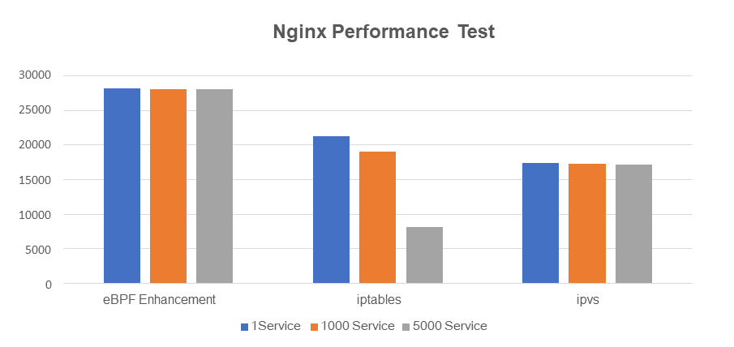

{{preview}}

We will not attempt to close the gap with the former series, the eBPF community
has been way too active. We will instead focus on the latest news over October,
November 2020, there is plenty to list. From new tutorials to academic research
and kernel discussions, everyone should find a good read or two!

{{/preview}}

[_Fuzzing for eBPF JIT bugs in the Linux kernel_](https://scannell.me/fuzzing-for-ebpf-jit-bugs-in-the-linux-kernel/),
from Simon Scannell.
Fuzzing tools are very helpful to discover bugs in software, and the eBPF
subsystem is no exception. This write-up details the architecture and the
generator used to build such a fuzzer, and explains how it let to the
discovery of a kernel vulnerability. The kernel has been patched since then.