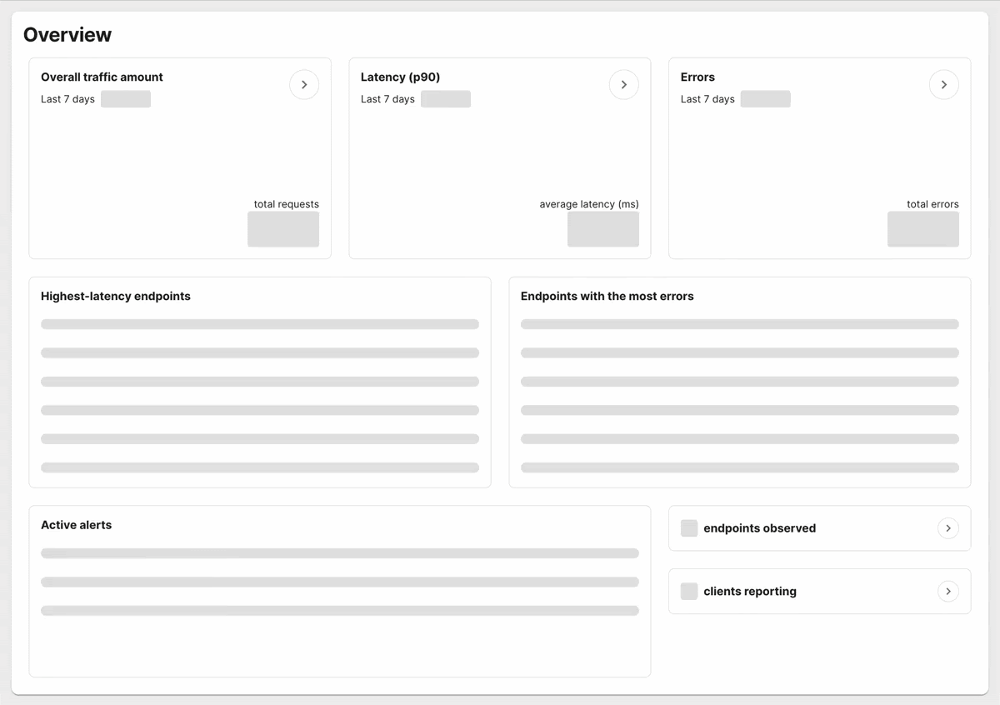

November 4th, 2022
Author: Jean Yang - Akita Software, Bill Mulligan - Isovalent

# Why eBPF for All Means People Don’t Need to Care about eBPF
A couple months ago, the two of us got to talking about a phenomenon we both observed.

On the one hand, there are more eBPF-based products and companies than ever before, lighting operations and platform teams abuzz. On the other hand, if you ask the average developer, the term “eBPF” feels foreign and irrelevant to them.

Bill is a Community Pollinator at Isovalent and Jean is the founder and CEO of Akita, both eBPF-powered companies. Both of us have been seeing massive shifts in the market, both among SaaS and subscription software buyers and investors, towards favoring eBPF. How could it be that a technology so much on the rise, for solid technical reasons, could be perceived as boring and irrelevant to much of the general developer population?

One clue came from a conversation Jean had with an Akita user a few months ago. The user said that the word “eBPF” had meant nothing to them until they started using Akita, after which it became synonymous with “drop-in” and “easy to integrate.”

This made us wonder if we needed to rethink how we were talking about eBPF. Both of us had been thinking of eBPF front and center, as the technology that unlocks all kinds of magic for users. But from the users’ point of view, the main win is not the technology, but the magic! Our conversation led us to write this blog post, with the goal of helping developers get excited about the buzz around eBPF rather than afraid. 

Our take: eBPF is going to become ubiquitous, but the majority of software teams and companies are not going to need to worry about it. In this blog post, we’ll talk about the rise of eBPF, what eBPF is, why people might not think eBPF is “for them” (and they’re right!), and our vision for “eBPF inside.”

# The Rise of eBPF
eBPF has been around for 8 years and its predecessor, BPF, for almost 30 years. Ancient by developer standards. However, recently, there has been a massive rise in companies talking about eBPF, using eBPF, and buying solutions that use eBPF.

Major players in monitoring, observability, networking, and security like Datadog, F5, VMware, and Cloudflare have rolled out eBPF based offerings in the last couple of years. Startups, our two companies Isovalent and Akita included, have come onto the scene with the sole purpose of leveraging eBPF in their solutions. There has even been the first acquisition (Seekret by Datadog) of an eBPF focused company.

Open source projects are also sweetening to eBPF. The [eBPF Landscape](http://ebpf.io/landscape) has become crowded with over 40 projects ranging from continuous profiling to energy monitoring. eBPF has even become so important that Microsoft now has an [eBPF for Windows project](https://github.com/microsoft/ebpf-for-windows). How did this technology, previously familiar only to networking enthusiasts, reach such widespread dominance across so many use cases.

# What is eBPF?

eBPF powers faster networking, easier monitoring and observability, and stronger security. How can one technology make this all possible?

Before we dive into the magic, let's first figure out what eBPF actually is. Pulling from [ebpf.io](https://ebpf.io/) gets us:

    “eBPF is a revolutionary technology with origins in the Linux kernel that can run sandboxed programs in an operating system kernel. It is used to safely and efficiently extend the capabilities of the kernel without requiring to change kernel source code or load kernel modules.”

But seeing how most people have never installed a kernel module, let alone looked at Linux source code, I don’t think this is getting us very far. What a lot of people do have experience with though is the web. In fact you are probably reading this on a web browser right now.

If you look at web pages from the 90s, they were flat static pages of information to be consumed. Then along came Javascript which allowed us to make the browser interactive and programmable. Suddenly, we could have games, forms, checkout, and many more new ways to exchange information. This unlocked a whole wave of innovation because programmers could add the functionality they wanted directly to the webpage without having to wait for browsers to release their next version. 

Javascript made the web programmable and that is exactly what eBPF is doing to the Linux kernel. Instead of having to wait years for a feature to be added to the Linux kernel and finally land in a vendor’s LTS release in production, new functionality can be added on the fly.

eBPF not only reduces the time it takes to have new features added to production workloads, in some cases, it even finally makes it possible. Because of the broad adoption of the Linux kernel across billions of devices, making changes is not taken lightly. For example, if you want a new way to observe your application and need to be able to pull that metric from the kernel, you have to first convince the kernel community that it is a good idea - and a good idea for everyone running Linux - then it can be implemented. With eBPF, you can now go from coding to observation without even having to reboot your machine.

All of this has unlocked many [new ways of doing things](https://ebpf.io/case-studies) across areas like networking, observability, and security. Going back to the ebpf.io website, we can find some that make sense:

    “Providing high-performance networking and load-balancing in modern data centers and cloud native environments, extracting fine-grained security observability data at low overhead, helping application developers trace applications, providing insights for performance troubleshooting, preventive application and container runtime security enforcement, and much more.”

eBPF has become a general purpose compute engine within the Linux kernel that allows you to hook into, observe, and act upon anything happening in the kernel, kind of like a plug-in for your web browser.

All of the gadgets are great, but just like on the web, if a screen takes more than 2 seconds to load, people will have already lost interest and moved back to Twitter. If eBPF slows down the kernel, it might not actually be worth the effort. Luckily, that is not the case. Since eBPF is running in the kernel, in most cases it is actually faster than running a program in user space because it is saving the context switching from kernel space to user space. In addition, eBPF is JIT compiled so it runs at near native execution speed. For example, when [Seznam.cz switched to eBPF based load balancing](https://cilium.io/blog/2022/04/12/cilium-standalone-L4LB-XDP/), they were able to double their packet throughput while also reducing their CPU usage 72x. Talk about being able to load pictures of cats very quickly!

If security or “DevSecOps” is your concern, you might be worried about running code in your kernel. First, eBPF programs by default can only be loaded by the root user. Hopefully you know who has root on your system and trust them, otherwise you have bigger problems than whether you should use eBPF or not. Second, eBPF has a verifier that all programs must pass before they can be run. The verifier ensures that the programs won’t crash the kernel and will safely run to completion. Security can’t be a second class citizen in the kernel and it isn’t with eBPF.

If all of this sounds too good to be true, you might be wondering what the catch is.

# Invisible technology, visible benefits: a vision for “eBPF inside”

The many developers who believe eBPF is “not for them” are right. eBPF is not for most developers _to program_. Most people also don’t write kernel modules, kernel patches, or container runtimes either - but they do massively consume and benefit from them. The same way most computers run with Intel chips, previously advertised with the “Intel Inside” sticker.

Just like containers did for packaging up your code and its dependencies in a reproducible way, eBPF allows you to do things that are currently “too good to be true”. And eBPF is on a similar to becoming mainstream through better developer experience. 

“Containers” had actually been around for a very long time from things like Solaris zones and FreeBSD jails using cgroups and namespaces to isolate processes. However, containers didn’t really become popular until Docker came along and made a smooth interface that developers could easily grasp and use, seamlessly bundling up code and its dependencies into one portable package. Most developers have never touched cgroups or namespaces, but trillions of containers have been pushed into production. Today, containers are an invisible technology that provides the very visible benefit of easily allowing you to ship your code to production.

eBPF is now the underlying technology and there are so many projects and use cases for it with very visible benefits:

* For example, Cilium is a networking project that uses [eBPF rather than iptables](https://cilium.io/blog/2018/04/17/why-is-the-kernel-community-replacing-iptables/) to provide high speed high throughput networking with minimal operational overhead. Cilium doesn’t expect developers to code eBPF programs to control their network, instead it abstracts away eBPF and provides networking that just works - and works at scale. eBPF isn’t for users of Cilium, it is for Cilium itself.

* Akita uses eBPF to support drop-in monitoring and observability. Typically, software teams need to include libraries and/or instrument their code in order to get the metrics and logs for observability. Startup cost and the work involved in thoroughly instrumenting code are both barriers to teams having the degree of visibility they want in their own systems. Using eBPF, the Akita agent is able to passively watch network traffic, sending network packets back for processing to the Akita cloud. The Akita cloud then reconstructs API structure and behavior from these packets, making it possible to support “drop-in” monitoring that does not require code changes. Akita users need to know nothing about eBPF; it’s simply what Akita uses under the hood in order to support quick installation and provide instant API dashboards.

When people say that eBPF is “not for them”. It is similar to a developer using Docker saying “cgroups are not for me”. They’re right, but there _is_ something for them that we’re not talking about. They may not interact with directly or code the underlying technology, but they do want its “magical” benefits.

**eBPF will be for everyone, but we don’t expect everyone to know about it**

The two of us know that eBPF is a powerful force that is transforming the software industry. We’ll know that it is successful not when all developers know about it, but when developers start demanding faster networking, effortless monitoring and observability, and easier-to-use security solutions. We believe that eBPF will have taken over when there’s a variety of products providing massive developer experience improvement over upstreaming code to the Linux kernel or writing Linux kernel modules.

The dream: eBPF will be available to everyone through solutions that leverage it to provide better developer experience. And people will recognize eBPF not by name, but by capability: through solutions that will be able to do things that are only currently “too good to be true”. Make sure you look for the eBPF inside label on your next SaaS or software purchase.
